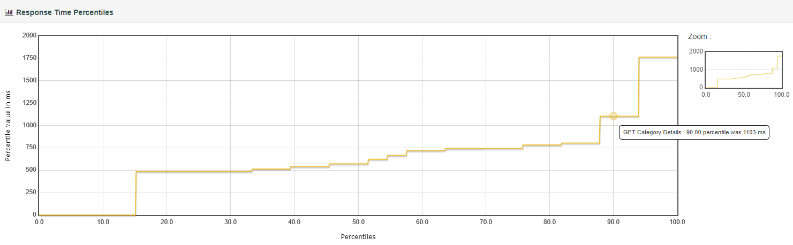
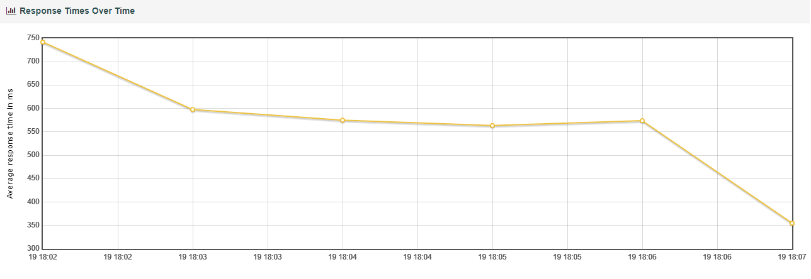

This repository was created in response to a technical assignment from Assurity.

## Prerequisites

To enable auto performance testing for JMeter, we can use Taurus which gives us pass/fail criteria.
Install `Taurus` locally -> following the installation directions here: https://gettaurus.org/install/Installation/

Ensure both docker and docker-compose are installed

Ensure jmeter is installed, and that the path `apache-jmeter-5.5\bin` has been added to local environment variables

For dashboarding through a local instance of Grafana, clone this Grafana/InfluxDB docker based solution, and follow the guide to get running locally:
https://github.com/testsmith-io/jmeter-influxdb-grafana-docker


**Installation**

Clone the generated repository on your local machine:

```bash
git clone https://github.com/robhansen-gemini/assurity-assignment.git
```

**Running the test**

Navigate to the root directory where the project was cloned, and run this command:

```bash
jmeter -f -n -t assurity-assignment.jmx -l logs\run.jtl -Jthreads=5 -Jrampup=5 -Jduration=60 -Jthroughput=10.0 -e -o logs
```

One way of viewing the test results is to navigate to the logs folder in the root of the solution and open `index.html`


You can also view the results in the Grafana Dashboard using this url: http://localhost:3000/?orgId=1 and selecting the appropriate run (once Grafana opens, click `Browse Dashboards` and select `JMeter Dashboard`)

`Note:` A listener has been configured in the jmx script which sends the JMeter performance data to the local Grafana instance


In order to run for continuous integration, run the following command:
```bash
bzt taurus-run.yml passfail.yml
```

The pass/fail criteria fails the test automatically if there are failures in the script, or if the P90 response time is greater than 500ms

## Report - Observations

Even though a constant throughput timer set the number of samples to 10 per minute, a total of 33 transactions were completed.
The througput timer needs more time over which to average a constant 10 transactions per minute as specified in the brief.
There were 2 failed requests and this represents a 6.06 failure rate.

  

The graph shows a total of 5 vusers active on the system during the test.

The failures were caused by the assertion of the CanRelist value being false:

  

Percentile response times for the GET Category Details API call are shown below:

  

For this particular run, the P90 value was measured to be 1103ms.

The reason the test failed the p90 response time assertion is because of the high latency that exists between South Africa and New Zealand (where the server is located).
Most of the time of the call is taken up by network latency:

  


